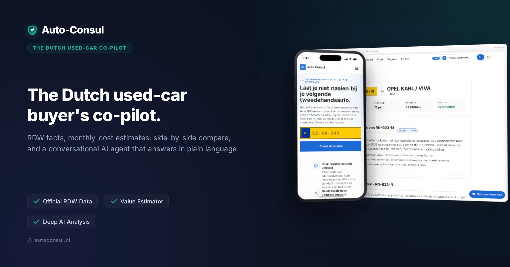
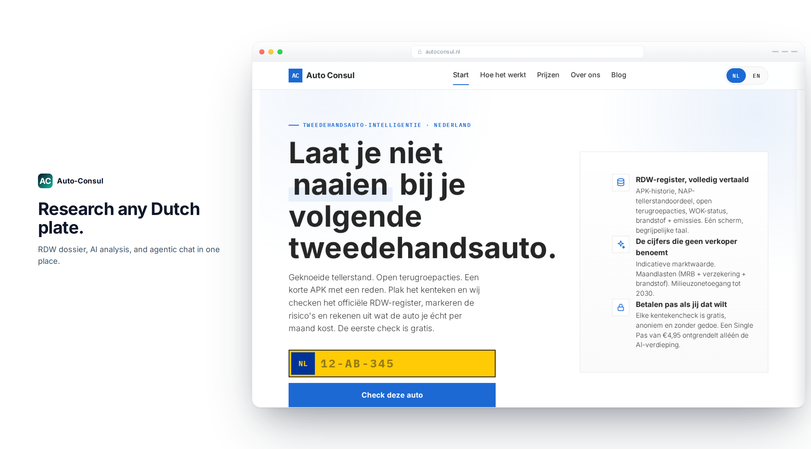
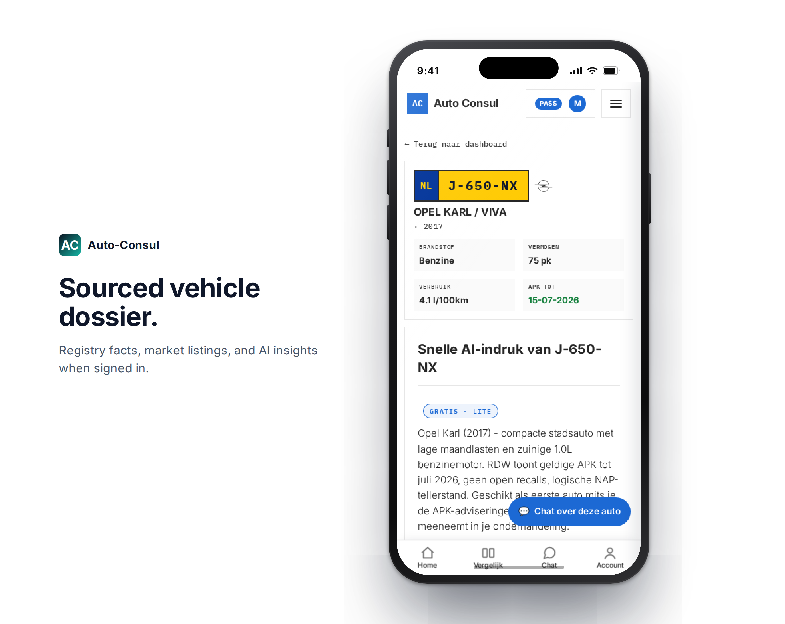
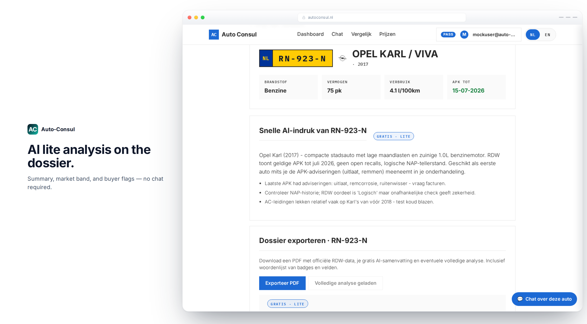
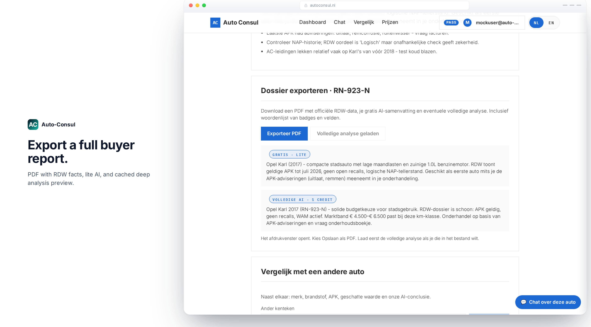
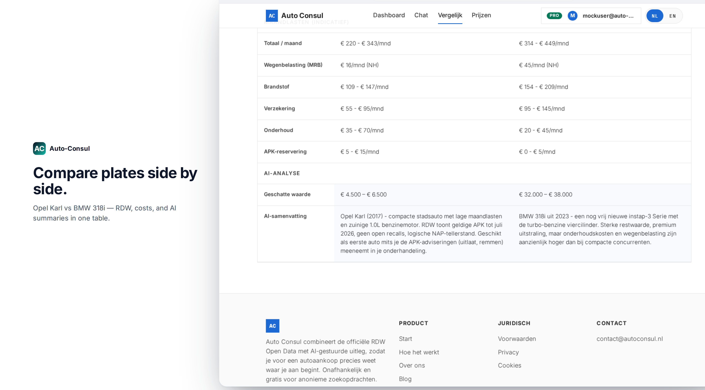
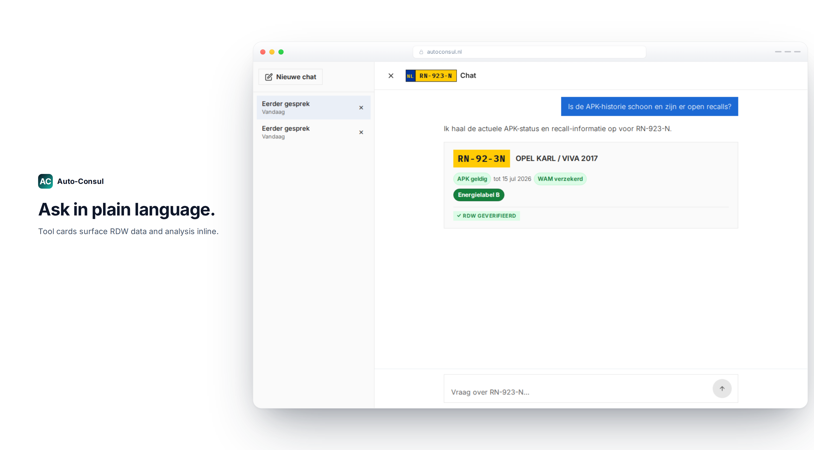
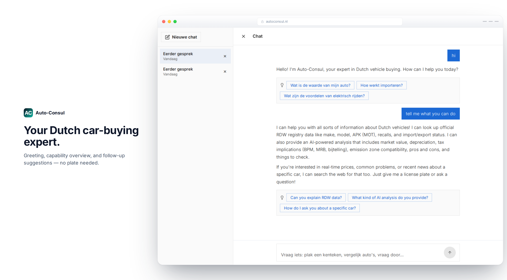
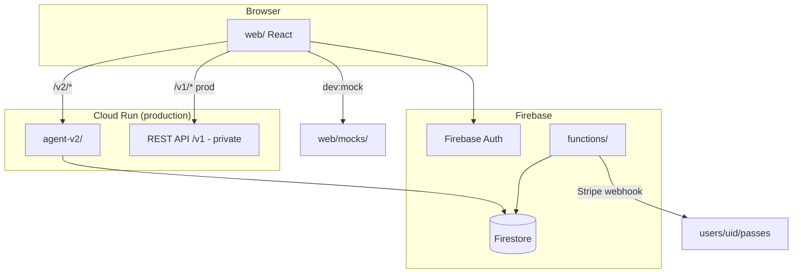

# Auto-Consul

**The Dutch used-car buyer’s co-pilot** - enter a kenteken, get an RDW-sourced dossier, AI analysis, side-by-side compare, and a chat agent that answers in plain language with verified tool cards.

<p align="center">
  <a href="https://www.autoconsul.nl"><strong>→ Live app: autoconsul.nl</strong></a>
</p>

<p align="center">
  <a href="https://www.autoconsul.nl">Website</a> ·
  <a href="https://www.autoconsul.nl/voertuig/KHV50Z">Example dossier</a> ·
  <a href="https://www.autoconsul.nl/prijzen">Pricing</a>
</p>

---

<p align="center">
  
  <br />
  <em>Home - research any Dutch plate</em>
</p>

## The problem

Buying a second-hand car in the Netherlands means jumping between RDW lookups, NAP checks, APK history, insurance quotes, and forum threads - then still wondering whether the asking price is fair. Generic chatbots guess; they don’t cite registry facts or show their work.

**Auto-Consul solves that** by combining official **RDW Open Data**, structured **monthly-cost estimates**, **tiered AI analysis**, and an **agentic chat** that calls tools (RDW lookup, analysis, web search) and renders results inline - so you can decide faster and negotiate with evidence.

---


## Product tour

### Enter a plate → get the dossier

Lookup on the home page or go straight to a vehicle. Registry facts, APK status, and market context in one place.

<p align="center">
  
  <br />
  <em>Home - research any Dutch plate</em>
</p>

<p align="center">
  
  <br />
  <em>Dossier - RDW facts for A-898-CD (BMW 320i)</em>
</p>

### AI analysis on the dossier

Lite analysis highlights market range and what to check before you buy - no chat required.

<p align="center">
  
  <br />
  <em>AI lite - summary and buyer flags on the dossier page</em>
</p>

### Export a buyer report

Export PDF bundles RDW data with lite and deep AI previews - ready for a viewing checklist or negotiation notes.

<p align="center">
  
  <br />
  <em>Export - PDF with RDW, lite AI, and cached deep analysis</em>
</p>

### Compare two (or three) cars

See monthly costs, estimated value, and AI summaries in one table - e.g. premium BMW 320i vs sport BMW 318i.

<p align="center">
  
  <br />
  <em>Compare - costs and AI summaries side by side</em>
</p>

### Ask in plain language - tool cards show the work

Chat is pinned to the plate. The agent calls RDW tools and streams structured cards instead of hand-wavy text.

<p align="center">
  
  <br />
  <em>Chat - pre-filled demo thread with verified RDW data inline</em>
</p>

### Welcome chat - what can Auto-Consul do?

Start without a plate: greet the agent, see suggested questions, and get a clear overview of RDW lookups, AI analysis, and web search.

<p align="center">
  
  <br />
  <em>Onboarding chat - greeting, capabilities, Dutch + English follow-ups</em>
</p>

> All captures above use **mock data** (`A898CD`, `J640HX`) from `web/mocks/` for offline marketing and dev. The live app at [autoconsul.nl](www.autoconsul.nl) uses production backends.

---

## What’s in this repo

This repository ships the **web app**, **Python chat agent**, and **Firebase Functions**. The production REST API (`/v1/*`) and infrastructure-as-code live in a separate private monorepo - see [`docs/what-is-not-included.md`](docs/what-is-not-included.md).

```
├── web/           React + Vite PWA - dossier UI, CopilotKit chat, compare, account
├── agent-v2/      Python FastAPI + Google ADK + AG-UI - tools, billing, sessions
├── functions/     Stripe webhook, welcome pass on signup, dev API mocks
└── docs/          Architecture, run guides, screenshots
```

| Folder | Role |
|--------|------|
| `web/` | Frontend - React 18, CopilotKit v2, generative tool cards |
| `agent-v2/` | Chat agent - Vertex AI Gemini, RDW tools, credit/chat-turn billing |
| `functions/` | Event-driven glue - passes, Stripe, Firestore rules |
| `docs/` | Deep dives on agent, frontend, functions, infrastructure |

### Stack

| Layer | Technology |
|-------|------------|
| Chat UI | CopilotKit v2, `@ag-ui/client` |
| Agent | Google ADK, `adk-agui-middleware`, FastAPI |
| LLM | Vertex AI Gemini |
| Backend glue | Firebase Functions Gen 2 |
| Data | Firestore, Firebase Auth |
| App | React 18, Vite, TypeScript |

---

## Architecture



**Billing:** credits and chat turns consume from the active pass with the **soonest `expiresAt`**. Only `functions/` writes paid passes after Stripe checkout.

---

## Credentials

| Service | Where to get it |
|---------|-----------------|
| **Vertex AI** | GCP Console → Vertex AI → `gcloud auth application-default login` |
| **RDW** | [opendata.rdw.nl](https://opendata.rdw.nl) - optional locally |
| **Firebase** | Firebase Console → Web app config → `web/.env.local` |
| **Stripe** | Dashboard test keys + Stripe CLI for webhooks |

Production: [`docs/infrastructure.md`](docs/infrastructure.md).

---
### Quick start (mock mode)

The fastest way to run the app locally - no agent, no Firebase, no backend.

```bash
cd web
npm install
npm run dev:mock
```

Open http://localhost:5173/voertuig/A898CD

| Page | URL |
|------|-----|
| Home | http://localhost:5173/ |
| Dossier (BMW 320i) | http://localhost:5173/voertuig/A898CD |
| Dossier (BMW) | http://localhost:5173/voertuig/J640HX |
| Chat (mock agent) | http://localhost:5173/v2/chat?mockAuth=on&plate=A898CD |
| Chat (demo thread) | http://localhost:5173/v2/chat?mockAuth=on&plate=A898CD&session=marketing-demo |
| Chat (onboarding) | http://localhost:5173/v2/chat?mockAuth=on&session=marketing-onboarding |
| Compare (2 cars, AI) | http://localhost:5173/compare?plates=A898CD,J640HX&mockAuth=on&mockTier=pro |

**Mocks:** JSON fixtures under `web/mocks/` when you run `dev:mock`. Try plates **`A898CD`** (BMW 320i) or **`J640HX`** (BMW 318i). See [`web/mocks/README.md`](web/mocks/README.md).

---

## Documentation

| Doc | Topic |
|-----|--------|
| [overview.md](docs/overview.md) | System map and billing flow |
| [frontend.md](docs/frontend.md) | CopilotKit chat and generative cards |
| [agent.md](docs/agent.md) | Python agent, tools, middleware |
| [functions.md](docs/functions.md) | Stripe webhook and welcome pass |
| [infrastructure.md](docs/infrastructure.md) | GCP platform setup |
| [running-locally.md](docs/running-locally.md) | Extended local dev guide |
| [what-is-not-included.md](docs/what-is-not-included.md) | Private REST API and Terraform |

---

## License

See repository license file when published.
