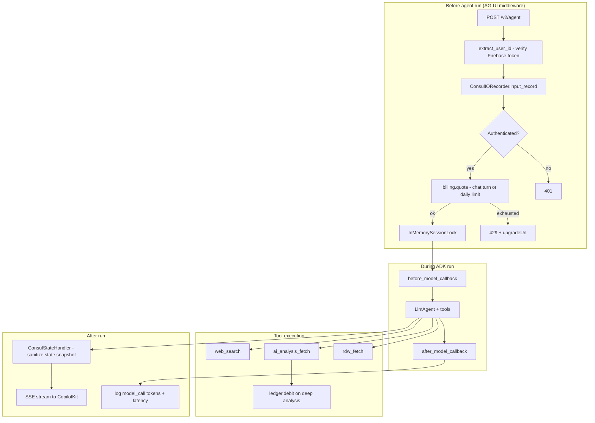

# Python agent

FastAPI service running a Google ADK `LlmAgent`, exposed via the **AG-UI protocol** (`adk-agui-middleware`). The React chat connects as an `@ag-ui/client` `HttpAgent`.

## Layout

```
agent-v2/
├── main.py              FastAPI + AG-UI + history + /v2/analysis
├── agent.py             LlmAgent + before/after model callbacks
├── tools/               rdw_fetch, ai_analysis_fetch, web_search, …
├── auth/                Firebase Bearer verification
├── billing/             Chat-turn quota, credit ledger, pass selection
├── middleware/          Session lock, IO hooks, model telemetry
├── sessions/            Firestore session service (production)
├── cache/               24h RDW + analysis cache
└── config/              Env vars, ADK runner wiring
```

## Agent turn pipeline

Every inbound chat message passes through layered hooks **before and after** the LLM runs:



### 1. Pre-turn gate (`billing/handlers.py`)

`CreditCheckHandler` runs on every turn via `ConsulIORecorder`:

| Step | Behaviour |
|------|-----------|
| Auth | Reject `guest` or missing uid → **401** |
| Active pass | Decrement `chatBudget.remaining` on the user's pass |
| No pass | Increment daily turn counter (free tier, default 20/day Amsterdam time) |
| Exhausted | **429** with `chat_turns_exhausted` or `daily_limit` + `upgradeUrl: /prijzen` |

Quota reads **fail open** - a transient Firestore error never blocks a paying user.

### 2. Before / after model (`middleware/telemetry.py`)

Registered on `LlmAgent` as ADK callbacks:

| Callback | When | What |
|----------|------|------|
| `before_model` | Each LLM call in a tool-chaining turn | Records start time in a `ContextVar` |
| `after_model` | LLM response received | Writes `credit_events` row: `tool_name=model_call`, token counts, latency ms |

This is **telemetry only** (`cost=0`). Chat turns are billed separately via `chat_turn` events. A single user message can trigger multiple model calls (agent reasons → calls tool → reasons again), so you get one `model_call` row per LLM invocation.

### 3. Credit debit on tools (`billing/ledger.py`)

| Event | When | Cost |
|-------|------|------|
| `chat_turn` | Pre-turn gate | 0 (consumes chat budget, not credits) |
| `ai_analysis_lite` | Free lite analysis | 0 |
| `ai_analysis_deep` | Paid deep analysis | 1 credit |
| `rdw_fetch` | RDW lookup | 0 (logged as free) |
| `model_call` | After each LLM call | 0 (telemetry) |

### Pass selection

Credits and chat turns consume from the ACTIVE pass with the soonest `expiresAt`. Shorter-lived passes drain before longer paid packs when both are active.

Implementation: `billing/pass_selector.py` orders passes by `expiresAt`. Both `quota.consume_chat_turn` and `ledger.debit` use this ordering.

## Tools

| Tool | Purpose |
|------|---------|
| `rdw_fetch` | RDW Open Data - cached 24h in Firestore `vehicleCache` |
| `ai_analysis_fetch` | Gemini JSON analysis - lite (free) or deep (1 credit) |
| `web_search` | Grounded search with citations (isolated genai call) |
| `suggest_compare` | Multi-car comparison prompt |
| `suggest_followups` | Follow-up question chips for the UI |

Tool names are **snake_case** - must match `useRenderTool({ name: "rdw_fetch" })` in the React app.

## Endpoints

| Method | Path | Auth |
|--------|------|------|
| POST | `/v2/agent` | Bearer - AG-UI agent run (SSE) |
| GET | `/v2/agent/info` | Public - CopilotKit probe stub |
| GET | `/v2/agent/thread/list` | Bearer - chat history |
| GET | `/v2/agent/message_snapshot/{id}` | Bearer - reload thread |
| GET | `/v2/analysis` | Bearer - REST analysis for dossier/compare pages |
| GET | `/health` | Public |

## Sessions

Production uses `AdkFirestoreSessionService` (shared schema with the private REST API). Local dev defaults to in-memory sessions unless `GOOGLE_CLOUD_PROJECT` is set.

Set `SESSION_BACKEND=memory` or `firestore` explicitly.

## Credentials

| Variable | Purpose |
|----------|---------|
| `GOOGLE_CLOUD_PROJECT` | Vertex AI + Firestore |
| `GOOGLE_CLOUD_LOCATION` | Vertex region (`europe-west4`) |
| `MODEL_NAME` / `LITE_MODEL` / `DEEP_MODEL` | Gemini models |
| `RDW_API_KEY_ID` + `RDW_API_KEY_SECRET` | RDW Open Data (optional; higher rate limits) |
| `FREE_DAILY_TURN_LIMIT` | Free-tier daily chat cap (default 20) |

See `agent-v2/.env.example` and [infrastructure.md](./infrastructure.md) #7.

## Tests

```bash
cd agent-v2
pip install -r requirements.txt -r requirements-dev.txt
pytest
```

Covers RDW parsing, quota, ledger, credit gate, session projection, web search, and analysis.

## Related docs

- [functions.md](./functions.md) - pass creation via Stripe and welcome grant
- [frontend.md](./frontend.md) - generative UI in the web app
