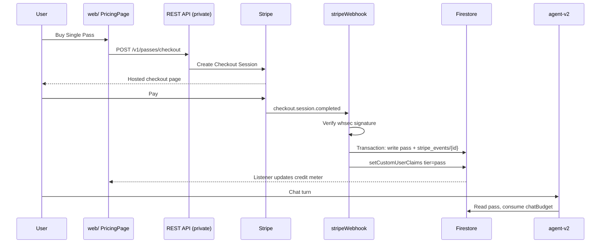
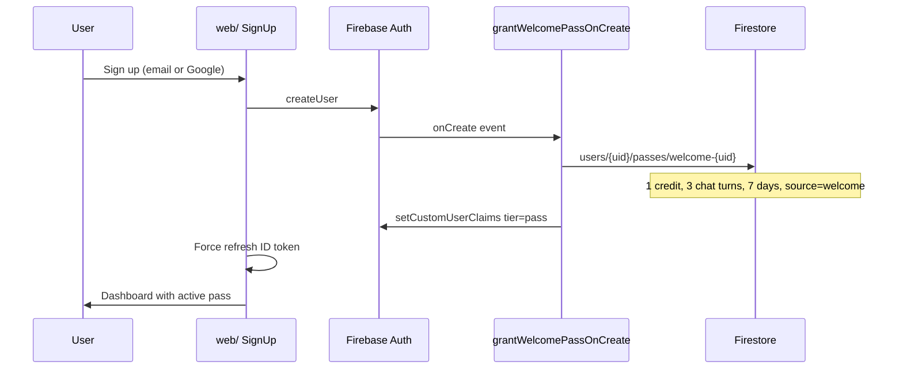

# Firebase Functions

TypeScript **Firebase Functions Gen 2** glue between Stripe, Firebase Auth, and Firestore. These functions are the **only writers** of paid pass documents after checkout - the Python agent and web app only read credits and chat budgets.

Region: `europe-west4` (set in `src/index.ts` via `setGlobalOptions`).

## Functions

| Export | Trigger | Purpose |
|--------|---------|---------|
| `stripeWebhook` | HTTPS | Verifies Stripe signature; writes `users/{uid}/passes/{passId}`; sets `tier: pass` custom claim |
| `grantWelcomePassOnCreate` | Auth `onCreate` | Grants a free welcome pass (1 credit, 3 chat turns, 7-day TTL) on signup |
| `rdwMock` | HTTPS | Dev/staging RDW API mock (Socrata-style) |
| `autotelexMock` | HTTPS | Dev/staging Autotelex API mock |

## Stripe webhook flow



**Idempotency:** each Stripe event id is stored at `stripe_events/{event.id}`. Replays are no-ops.

**Security:** the agent never writes to `users/{uid}/passes/`. Only this function does, after signature verification.

## Welcome pass flow



Doc id `welcome-{uid}` prevents duplicate grants on event redelivery.

## Layout

```
functions/
├── src/
│   ├── index.ts           Exports + global region
│   ├── welcome.ts         Auth onCreate welcome pass
│   ├── stripe/
│   │   ├── webhook.ts     Checkout handler
│   │   └── types.ts
│   ├── lib/
│   │   ├── admin.ts       Firebase Admin singleton
│   │   └── mockScenario.ts
│   └── mocks/             Dev-only RDW + Autotelex proxies
├── firestore.rules        Security rules (users read own data; passes write = false from client)
└── package.json
```

Deploy: `firebase deploy --only functions` after building (see [infrastructure.md](./infrastructure.md) #6).

## Local development

```bash
cd functions
npm install
npm run build
firebase emulators:start --only functions,firestore,auth
```

### Stripe webhook smoke test

```bash
stripe listen --forward-to \
  http://127.0.0.1:5001/YOUR_PROJECT/europe-west4/stripeWebhook

stripe trigger checkout.session.completed \
  --add checkout_session:metadata.uid=test_uid \
  --add checkout_session:metadata.pack=SINGLE
```

Secrets `STRIPE_SECRET` and `STRIPE_WEBHOOK_SECRET` are bound via `defineSecret()` and must exist in Secret Manager in cloud (Terraform provisions them in the private infra module).

### Firestore rules tests

```bash
npm run test:rules
```

## Environment / secrets

| Secret | Used by |
|--------|---------|
| `STRIPE_SECRET` | Webhook (optional client ops) |
| `STRIPE_WEBHOOK_SECRET` | Webhook signature verification |

## Connection to agent-v2

After `grantWelcomePassOnCreate` or `stripeWebhook`:

1. Firestore has an active pass with `chatBudget.remaining` and `credits.remaining`
2. User's ID token may include `tier: pass`
3. On each chat turn, `agent-v2` `billing/handlers.py` runs **before** the ADK agent:
   - Authenticates the user
   - Calls `billing.quota.consume_chat_turn` or daily free limit
   - Returns HTTP 429 with `upgradeUrl` when exhausted (web shows `UpgradePrompt`)

Deep analysis debits credits inside `tools/analysis.py` via `billing.ledger.debit` - separate from the per-turn chat budget.

See [agent.md](./agent.md) for the full before/after hook pipeline.
