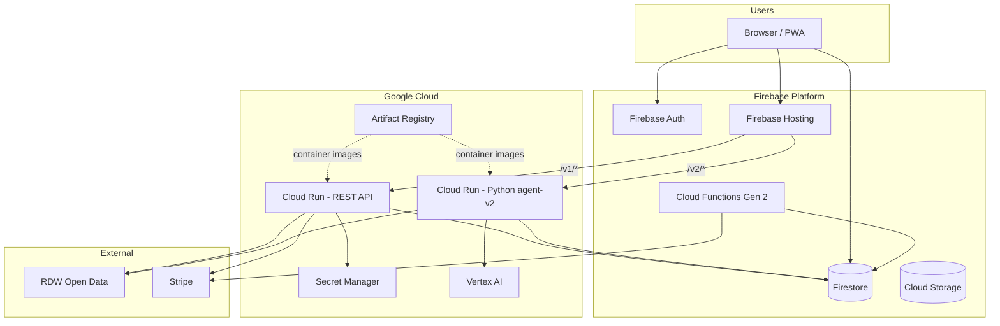
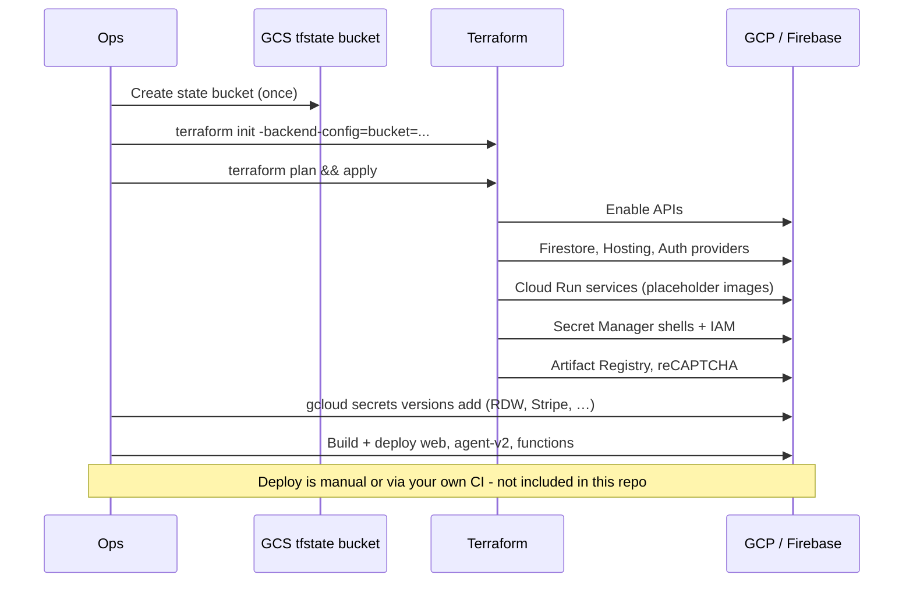
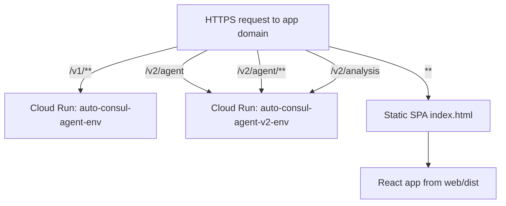
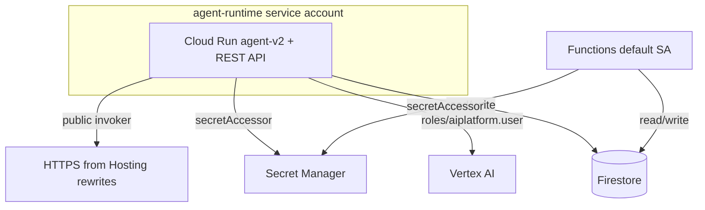

# Google Cloud infrastructure

How Auto-Consul is set up on Google Cloud. **Terraform source is not in this repository** - it lives in the private `ai-auto-consul` monorepo. This document describes the architecture, bootstrap flow, and credentials so you can understand or recreate the platform.

Region: **`europe-west4`** (Netherlands) for GDPR and latency.

---

## 1. Platform map



**Same-origin routing:** Firebase Hosting serves the static React build and rewrites API paths to Cloud Run. The browser never calls Cloud Run URLs directly.

---

## 2. Terraform module (private repo)

The private `infra/terraform/` module is one root module per environment (`dev`, `staging`, `prod`).

| File | Provisions |
|------|------------|
| `project.tf` | GCP project (optional create), Firebase enablement |
| `apis.tf` | Required APIs: Run, Firestore, Secret Manager, Vertex, reCAPTCHA, … |
| `firestore.tf` | Firestore Native (`eur3`), TTL policies |
| `firebase-web.tf` | Firebase web app + config for Vite build |
| `identity-platform.tf` | Google + email/password auth |
| `hosting.tf` | Hosting targets |
| `storage.tf` | Uploads bucket for photos/PDFs |
| `artifact-registry.tf` | Docker repository |
| `iam.tf` | Service accounts + IAM bindings |
| `secrets.tf` | Secret Manager (RDW, Autotelex, Stripe) |
| `cloud-run-agent.tf` | Cloud Run services (REST API + Python) |
| `recaptcha.tf` | reCAPTCHA Enterprise for App Check |
| `stripe.tf` | Stripe products/prices (optional) |

State is stored in a **GCS bucket** (`<project>-tfstate`) with versioning enabled.

---

## 3. Bootstrap sequence



### One-time manual steps

1. **State bucket** - must exist before `terraform init`.
2. **Secret values** - Terraform creates empty Secret Manager secrets; ops adds real values with `gcloud secrets versions add`.
3. **Deploy applications** - after infra exists, build and deploy `web/`, `agent-v2/`, and `functions/` to Hosting and Cloud Run (see #6).

---

## 4. Firebase Hosting rewrites

Production traffic routing:



Local dev mirrors this: Vite proxies `/v2` to `localhost:8081`.

---

## 5. IAM and runtime identity



**Security model:** Cloud Run is publicly reachable at the edge; **Firebase ID token + App Check** are enforced inside the application.

---

## 6. Deploying application code (manual)

This repo does not include CI/CD pipelines. After Terraform provisions the platform:

| Component | Build | Deploy target |
|-----------|-------|---------------|
| `web/` | `npm run build` | `firebase deploy --only hosting` |
| `agent-v2/` | `docker build` → push to Artifact Registry | `gcloud run services update` |
| `functions/` | `npm run build` | `firebase deploy --only functions` |

Inject `VITE_FIREBASE_*` and `VITE_RECAPTCHA_SITE_KEY` at web build time from Firebase Console / Terraform outputs.

Cloud Run service names: `auto-consul-agent-v2-{env}`, `auto-consul-agent-{env}` (REST API, private repo).

---

## 7. Credentials you must obtain

### 7.1 Vertex AI (required for the Python agent)

Used for: chat (`LlmAgent`), lite/deep analysis, grounded `web_search`.

| Step | Action |
|------|--------|
| 1 | Create or select a GCP project |
| 2 | Enable **Vertex AI API** |
| 3 | Grant the runtime service account `roles/aiplatform.user` |
| 4 | Set `GOOGLE_CLOUD_PROJECT`, `GOOGLE_CLOUD_LOCATION`, `GOOGLE_GENAI_USE_VERTEXAI=TRUE` |
| 5 | Locally: `gcloud auth application-default login` |

### 7.2 RDW Open Data (required for vehicle lookup)

| Option | Setup |
|--------|--------|
| **Anonymous** | No credentials; lower shared rate limits |
| **Registered keys** | [opendata.rdw.nl](https://opendata.rdw.nl) → **Sleutel ID** + **Sleutel geheim** (HTTP Basic Auth) |

```
RDW_BASE_URL=https://opendata.rdw.nl/resource/m9d7-ebf2.json
RDW_API_KEY_ID=<Sleutel ID>
RDW_API_KEY_SECRET=<Sleutel geheim>
```

In production these live in **Secret Manager**, mounted into Cloud Run as env vars.

### 7.3 Firebase

| Item | Source |
|------|--------|
| Web app config | Firebase Console → Project settings |
| Admin SDK | Application Default Credentials on Cloud Run |
| App Check | reCAPTCHA Enterprise site key (Terraform `recaptcha.tf`) |

### 7.4 Stripe

| Item | Used by |
|------|---------|
| `STRIPE_SECRET` | Checkout API (private repo) |
| `STRIPE_WEBHOOK_SECRET` | `functions/stripeWebhook` |

---

## 8. Environments

| Env | Purpose | Notes |
|-----|---------|-------|
| `dev` | Development | Mock upstream URLs possible |
| `staging` | Pre-prod | Real integrations, lower max instances |
| `prod` | Live | Email verify before purchase, deletion protection on Run |

Each env uses a separate `terraform.tfvars` (or workspace) with `project_id` and `env`.

---

## 9. What this open-source repo contains

| Component | In this repo | Runs on |
|-----------|--------------|---------|
| `web/` | Yes | Firebase Hosting |
| `agent-v2/` | Yes | Cloud Run |
| `functions/` | Yes | Firebase Functions |
| REST API | No | Private monorepo |
| Terraform | No | Private monorepo (described here) |

---

## 10. Related docs

- [running-locally.md](./running-locally.md) - local dev without GCP
- [functions.md](./functions.md) - Stripe + welcome pass
- [what-is-not-included.md](./what-is-not-included.md) - REST API, Terraform source
