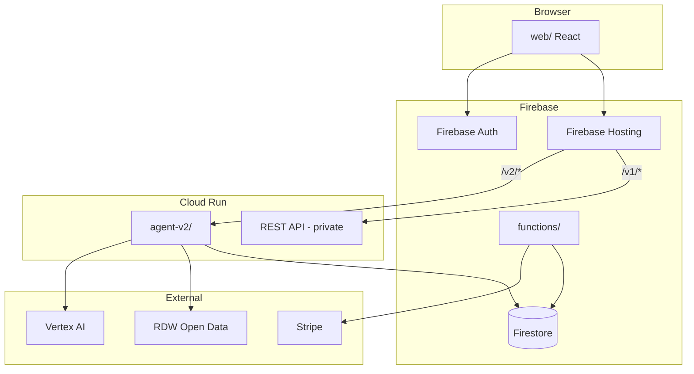
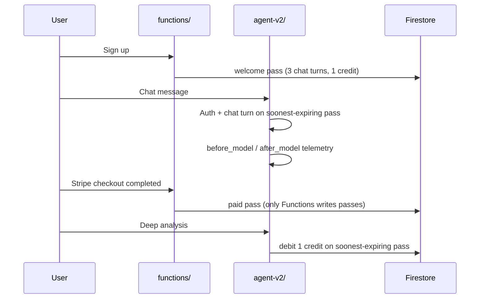

# Overview

Auto-Consul helps Dutch car buyers research a vehicle. Users enter a license plate or chat with the agent and receive a dossier: RDW registry data, AI analysis, and web citations where needed.

## Components in this repository

| Component | Folder | Role |
|-----------|--------|------|
| Web app | `web/` | React PWA - dossier, chat, compare, account |
| Chat agent | `agent-v2/` | Python ADK agent over AG-UI - tools, billing, sessions |
| Functions | `functions/` | Stripe webhook, welcome pass, dev API mocks |
| Docs | `docs/` | Architecture and operations |

## Not in this repository

The REST API (`/v1/*`) and Terraform modules are maintained in a private monorepo. See [what-is-not-included.md](./what-is-not-included.md).

## Architecture

## Billing flow

Credits and chat turns consume from the pass with the soonest `expiresAt`.

## Further reading

- [agent.md](./agent.md) - Python agent
- [frontend.md](./frontend.md) - Chat UI
- [functions.md](./functions.md) - Pass creation
- [infrastructure.md](./infrastructure.md) - GCP setup
